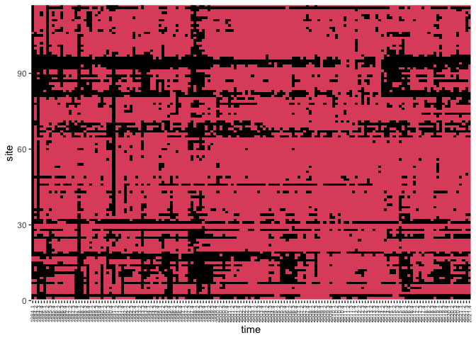

Investigate metapopulation dynamics in kelp
================

- [Read in data and set basic
  params](#read-in-data-and-set-basic-params)
  - [Plot the data](#plot-the-data)
- [Statistical models like Castorani et al. 2017
  PRSB.](#statistical-models-like-castorani-et-al-2017-prsb)
  - [Basic model.](#basic-model)
  - [Models with temperature and
    waves.](#models-with-temperature-and-waves)
- [Dynamic occupancy model](#dynamic-occupancy-model)
  - [Plot environmental functions](#plot-environmental-functions)
  - [Plot occupancy fits over space and
    time](#plot-occupancy-fits-over-space-and-time)
  - [Detectability through time](#detectability-through-time)
  - [Plot colonization fits over space and
    time](#plot-colonization-fits-over-space-and-time)
  - [Plot persistence fits over space and
    time](#plot-persistence-fits-over-space-and-time)

Builds from Miriam Wanner’s data processing code in
<https://github.com/miriamwanner/kelpsynchrony/blob/0.2.1/Code/init_data_processing.R>

Examines metapopulation dynamics for giant kelp in SoCal, 1984-2021

# Read in data and set basic params

``` r
library(ncdf4)
library(R.matlab)
```

    ## R.matlab v3.7.0 (2022-08-25 21:52:34 UTC) successfully loaded. See ?R.matlab for help.

    ## 
    ## Attaching package: 'R.matlab'

    ## The following objects are masked from 'package:base':
    ## 
    ##     getOption, isOpen

``` r
library(geosphere)
```

    ## The legacy packages maptools, rgdal, and rgeos, underpinning the sp package,
    ## which was just loaded, will retire in October 2023.
    ## Please refer to R-spatial evolution reports for details, especially
    ## https://r-spatial.org/r/2023/05/15/evolution4.html.
    ## It may be desirable to make the sf package available;
    ## package maintainers should consider adding sf to Suggests:.
    ## The sp package is now running under evolution status 2
    ##      (status 2 uses the sf package in place of rgdal)

``` r
library(ggplot2)
library(reshape2) # to get long data
library(glmmTMB)
library(ggeffects)
```

    ## Warning: package 'ggeffects' was built under R version 4.3.3

``` r
library(here)
```

    ## here() starts at /Users/mpinsky/Documents/UCSC/funding/applied/2025/2025-02 NSF BII/metaKelp

``` r
library(data.table) # for easier and faster manipulation of large tables
```

    ## 
    ## Attaching package: 'data.table'

    ## The following objects are masked from 'package:reshape2':
    ## 
    ##     dcast, melt

``` r
survival_rate <- 0.1 # this can be changed to recreate MRM results with different survival rates per day
```

Read in and aggregate biomass, wave, and sst data to match ROMS patches.
Read in from a file if available, since otherwise slow.

Calculate fecundity and dispersal probability. Uses the survival rate
set in the first code block.

## Plot the data

``` r
# plot biomass
kelpDataROMSSiteslong <- melt(kelpDataROMSSites, varnames = c('site', 'time'), value.name = 'biomass')
```

    ## Warning in melt(kelpDataROMSSites, varnames = c("site", "time"), value.name =
    ## "biomass"): The melt generic in data.table has been passed a matrix and will
    ## attempt to redirect to the relevant reshape2 method; please note that reshape2
    ## is deprecated, and this redirection is now deprecated as well. To continue
    ## using melt methods from reshape2 while both libraries are attached, e.g.
    ## melt.list, you can prepend the namespace like
    ## reshape2::melt(kelpDataROMSSites). In the next version, this warning will
    ## become an error.

``` r
kelpDataROMSSiteslong$time <- gsub('X', '', as.character(kelpDataROMSSiteslong$time))
ggplot(kelpDataROMSSiteslong, aes(x = time, y = site, fill = sqrt(biomass))) +
    geom_raster() + 
    theme(axis.text.x = element_text(angle = 90, vjust = 0.5, hjust=1, size = 6)) +
    coord_cartesian(ylim = c(0, 117), expand = FALSE)
```

<!-- -->

``` r
# plot occupancy
kelpDataROMSSiteslong <- melt(kelpDataROMSSites, varnames = c('site', 'time'), value.name = 'biomass')
```

    ## Warning in melt(kelpDataROMSSites, varnames = c("site", "time"), value.name =
    ## "biomass"): The melt generic in data.table has been passed a matrix and will
    ## attempt to redirect to the relevant reshape2 method; please note that reshape2
    ## is deprecated, and this redirection is now deprecated as well. To continue
    ## using melt methods from reshape2 while both libraries are attached, e.g.
    ## melt.list, you can prepend the namespace like
    ## reshape2::melt(kelpDataROMSSites). In the next version, this warning will
    ## become an error.

``` r
kelpDataROMSSiteslong$time <- gsub('X', '', as.character(kelpDataROMSSiteslong$time))
ggplot(kelpDataROMSSiteslong, aes(x = time, y = site, fill = I(biomass>0)*1+1)) +
    geom_raster() + 
    theme(axis.text.x = element_text(angle = 90, vjust = 0.5, hjust=1, size = 6)) +
    coord_cartesian(ylim = c(0, 117), expand = FALSE)
```

<!-- -->

``` r
# plot SST
sstROMSSiteslong <- melt(sstROMSSites, varnames = c('site', 'time'), value.name = 'sst')
```

    ## Warning in melt(sstROMSSites, varnames = c("site", "time"), value.name =
    ## "sst"): The melt generic in data.table has been passed a matrix and will
    ## attempt to redirect to the relevant reshape2 method; please note that reshape2
    ## is deprecated, and this redirection is now deprecated as well. To continue
    ## using melt methods from reshape2 while both libraries are attached, e.g.
    ## melt.list, you can prepend the namespace like reshape2::melt(sstROMSSites). In
    ## the next version, this warning will become an error.

``` r
sstROMSSiteslong$time <- gsub('X', '', as.character(sstROMSSiteslong$time))
ggplot(sstROMSSiteslong, aes(x = time, y = sst, group = site)) +
    geom_line(color = '#00000033') + 
    theme(axis.text.x = element_text(angle = 90, vjust = 0.5, hjust=1, size = 6)) 
```

<!-- -->

``` r
# plot waves
wavesROMSSiteslong <- melt(wavesROMSSites, varnames = c('site', 'time'), value.name = 'hs')
```

    ## Warning in melt(wavesROMSSites, varnames = c("site", "time"), value.name =
    ## "hs"): The melt generic in data.table has been passed a matrix and will attempt
    ## to redirect to the relevant reshape2 method; please note that reshape2 is
    ## deprecated, and this redirection is now deprecated as well. To continue using
    ## melt methods from reshape2 while both libraries are attached, e.g. melt.list,
    ## you can prepend the namespace like reshape2::melt(wavesROMSSites). In the next
    ## version, this warning will become an error.

``` r
wavesROMSSiteslong$time <- gsub('X', '', as.character(wavesROMSSiteslong$time))
ggplot(wavesROMSSiteslong, aes(x = time, y = hs, group = site)) +
    geom_line(color = '#00000033') + 
    theme(axis.text.x = element_text(angle = 90, vjust = 0.5, hjust=1, size = 6))
```

<!-- -->

``` r
# plot connectivity
connbySitebyYearlong <- melt(connbySitebyYear, varnames = c('site', 'time'), value.name = 'connectivity')
```

    ## Warning in melt(connbySitebyYear, varnames = c("site", "time"), value.name =
    ## "connectivity"): The melt generic in data.table has been passed a matrix and
    ## will attempt to redirect to the relevant reshape2 method; please note that
    ## reshape2 is deprecated, and this redirection is now deprecated as well. To
    ## continue using melt methods from reshape2 while both libraries are attached,
    ## e.g. melt.list, you can prepend the namespace like
    ## reshape2::melt(connbySitebyYear). In the next version, this warning will become
    ## an error.

``` r
connbySitebyYearlong$time <- as.character(wavesROMSSiteslong$time)
ggplot(connbySitebyYearlong, aes(x = time, y = connectivity, group = site)) +
    geom_line(color = '#00000033') +
    theme(axis.text.x = element_text(angle = 90, vjust = 0.5, hjust=1, size = 6))
```

<!-- -->

# Statistical models like Castorani et al. 2017 PRSB.

Set up data and sum into two semesters per year.

``` r
# set up variables by quarter
kelpstatsqtr <- data.frame(year = sapply(strsplit(kelpDataROMSSiteslong$time, split='\\.', ), `[`, 1),
                        quarter = sapply(strsplit(kelpDataROMSSiteslong$time, split='\\.'), `[`, 2),
                        site = kelpDataROMSSiteslong$site,
                        occ = kelpDataROMSSiteslong$biomass>0,
                        biomass = kelpDataROMSSiteslong$biomass
                        )
kelpstatsqtr$sem <- ifelse(kelpstatsqtr$quarter < 3, 1, 2)

# sum into semesters
kelpstats <- aggregate(cbind(biomass, occ) ~ sem + year + site, data = kelpstatsqtr, FUN = sum)
kelpstats$occ <- kelpstats$occ > 0 # reset occupancy to TRUE/FALSE

# prep occupancy in the previous semester
kelpstatsprev <- kelpstats[, c('year', 'sem', 'site', 'occ')]
names(kelpstatsprev) <- c('year', 'sem', 'site', 'prevocc')
kelpstatsprev$year <- as.numeric(kelpstatsprev$year)
kelpstatsprev$sem <- kelpstatsprev$sem + 1 # add one semester
kelpstatsprev$year[kelpstatsprev$sem == 3] <- 
    kelpstatsprev$year[kelpstatsprev$sem == 3] + 1 # if got beyond the last semester of the year, move to the next year
kelpstatsprev$sem[kelpstatsprev$sem == 3] <- 1 # if got beyond the last semester of the year, move to the first semester (of the next year)

unique(setdiff(paste0(kelpstats$year, '.', kelpstats$sem), paste0(kelpstatsprev$year, '.', kelpstatsprev$sem))) # should be missing 1984.1
```

    ## [1] "1984.1"

``` r
# prep the lagged connectivity. connectivity applies to the next semester
connbySitebyYearlonglagqtr <- connbySitebyYearlong # work on a copy of the quarterly connectivity
connbySitebyYearlonglagqtr$year <- as.numeric(sapply(strsplit(connbySitebyYearlonglagqtr$time, split='\\.', ), `[`, 1))
connbySitebyYearlonglagqtr$quarter <- sapply(strsplit(connbySitebyYearlonglagqtr$time, split='\\.', ), `[`, 2)
connbySitebyYearlonglagqtr$sem <- ifelse(connbySitebyYearlonglagqtr$quarter < 3, 1, 2)
connbySitebyYearlonglag <- aggregate(connectivity ~ sem + year + site, data = connbySitebyYearlonglagqtr, FUN = max) # use max across quarters for aggregation into semesters

connbySitebyYearlonglag$sem <- connbySitebyYearlonglag$sem + 1 # add a semester
connbySitebyYearlonglag$year[connbySitebyYearlonglag$sem == 3] <- 
    connbySitebyYearlonglag$year[connbySitebyYearlonglag$sem == 3] + 1 # if got beyond the last semester of the year, move to the next year
connbySitebyYearlonglag$sem[connbySitebyYearlonglag$sem == 3] <- 1 # and the first semester

unique(setdiff(paste0(kelpstats$year, '.', kelpstats$sem), paste0(connbySitebyYearlonglag$year, '.', connbySitebyYearlonglag$sem))) # should be missing 1984.1
```

    ## [1] "1984.1"

``` r
# add connnectivity and previous occupancy
dim(kelpstats)
```

    ## [1] 8892    5

``` r
kelpstats <- merge(kelpstats, connbySitebyYearlonglag[, c('site', 'year', 'sem', 'connectivity')])
dim(kelpstats)
```

    ## [1] 8775    6

``` r
kelpstats <- merge(kelpstats, kelpstatsprev)
dim(kelpstats)
```

    ## [1] 8775    7

``` r
# add max biomass as a proxy for patch size
maxbio <- aggregate(biomass ~ site, data = kelpstats, FUN = max)
names(maxbio) <- c('site', 'maxbio')
maxbio$maxbio.log <- log(maxbio$maxbio)
kelpstats <- merge(kelpstats, maxbio)

# add sst. trim out years without data.
sstROMSSiteslong$year <- as.numeric(sapply(strsplit(sstROMSSiteslong$time, split='\\.', ), `[`, 1))
sstROMSSiteslong$quarter <- as.numeric(sapply(strsplit(sstROMSSiteslong$time, split='\\.', ), `[`, 2))
sstROMSSiteslong$sem <- ifelse(sstROMSSiteslong$quarter < 3, 1, 2)
sst <- aggregate(sst ~ site + year + sem, FUN = mean, # aggregate by semester
                 data = sstROMSSiteslong[sstROMSSiteslong$year >= 1986 | (sstROMSSiteslong$year == 1985 & sstROMSSiteslong$sem == 2), ]) 
dim(kelpstats)
```

    ## [1] 8775    9

``` r
kelpstats <- merge(kelpstats, sst, all.x = TRUE)
dim(kelpstats)
```

    ## [1] 8775   10

``` r
# add waves
wavesROMSSiteslong$year <- as.numeric(sapply(strsplit(wavesROMSSiteslong$time, split='\\.', ), `[`, 1))
wavesROMSSiteslong$quarter <- as.numeric(sapply(strsplit(wavesROMSSiteslong$time, split='\\.', ), `[`, 2))
wavesROMSSiteslong$sem <- ifelse(wavesROMSSiteslong$quarter < 3, 1, 2)
waves <- aggregate(hs ~ site + year + sem, FUN = mean, data = wavesROMSSiteslong) # aggregate by semester

dim(kelpstats)
```

    ## [1] 8775   10

``` r
kelpstats <- merge(kelpstats, waves, all.x = TRUE)
dim(kelpstats)
```

    ## [1] 8775   11

``` r
# set up transformations
kelpstats$connectivity.log <- log(kelpstats$connectivity+1)
kelpstats$connectivity.log.std <- scale(kelpstats$connectivity.log)
kelpstats$biomass.sqrt <- sqrt(kelpstats$biomass)
kelpstats$biomass.sqrt.std <- scale(kelpstats$biomass.sqrt)
kelpstats$prevocc.f <- as.factor(kelpstats$prevocc)
kelpstats$hs.log <- log(kelpstats$hs+1)
```

## Basic model.

Use maxbio instead of patch area for now

``` r
mod <- glmmTMB(occ ~ connectivity.log + prevocc.f + maxbio.log + (1|year/sem) + (1|site), data = kelpstats, family = binomial(link = 'logit'))

toplot1 <- ggeffect(mod, "connectivity.log [all]")
plot(toplot1)
```

<!-- -->

``` r
toplot2 <- ggeffect(mod, "prevocc.f [all]")
plot(toplot2)
```

<!-- -->

``` r
toplot2 <- ggeffect(mod, "maxbio.log [all]")
plot(toplot2)
```

<!-- -->

## Models with temperature and waves.

Lower probability of occupancy with higher temperatures or waves, as
expected.

``` r
mod_env <- glmmTMB(occ ~ connectivity.log + prevocc.f + maxbio.log + sst + hs.log + (1|year/sem) + (1|site), data = kelpstats, family = binomial(link = 'logit'))
mod.trim <- glmmTMB(occ ~ connectivity.log + prevocc.f + maxbio.log + (1|year/sem) + (1|site), data = kelpstats[!is.na(kelpstats$sst),], family = binomial(link = 'logit')) # base model, trimmed to have the same number of observations as mod_env

AIC(mod.trim, mod_env)
```

    ##          df      AIC
    ## mod.trim  7 4451.381
    ## mod_env   9 4382.009

``` r
toplot1 <- ggeffect(mod_env, "connectivity.log [all]")
plot(toplot1)
```

<!-- -->

``` r
toplot2 <- ggeffect(mod_env, "prevocc.f [all]")
plot(toplot2)
```

<!-- -->

``` r
toplot3 <- ggeffect(mod_env, "maxbio.log [all]")
plot(toplot3)
```

<!-- -->

``` r
toplot4 <- ggeffect(mod_env, "sst [all]")
plot(toplot4)
```

<!-- -->

``` r
toplot5 <- ggeffect(mod_env, "hs.log [all]")
plot(toplot5)
```

<!-- -->

# Dynamic occupancy model

Read in from file if it exists. Inspired by
<https://bcss.org.my/tut/bayes-with-jags-a-tutorial-for-wildlife-researchers/occupancy-modelling/dynamic-occupancy-modelling/>

``` r
#model <- 'dyn_occ_null'
#model <- 'dyn_occ_temp'
model <- 'dyn_occ_full'

# Standardize covariates
ytokeep <- 6:152 # trim to years with sst
sstS <- wiqid::standardize(sstROMSSites[,ytokeep])
hsS <- wiqid::standardize(wavesROMSSites[,ytokeep])
maxbio.logS <- wiqid::standardize(matrix(maxbio$maxbio.log, nrow=nrow(sstS), ncol=ncol(sstS), byrow=FALSE))

if(file.exists(here('temp', paste0(model, '.rds')))){
    dyn_occ <- readRDS(here('temp', paste0(model, '.rds')))
    print('read jags fit from file')

} else {
    
    z <- (kelpDataROMSSites[,ytokeep] > 0)*1 # matrix of occupied (1) or not (NA). rows are sites, cols are time.
    z[z == 0] <- NA
    
    jdata <- list(nSites = nrow(z), nYears = ncol(z), y =(kelpDataROMSSites[,ytokeep]>0)*1,
                  z = z,  
                  n = (kelpDataROMSSites[,ytokeep]>0)*5, # set an abundance proxy. detection is ~1/proxy value
                  sst = sstS, 
                  hs = hsS,
                  maxbio = maxbio.logS)
    
    wanted <- c("Topt1", "width1", "Topt2", "width2", "Topt3", "width3", 
                "betapsi_maxbio", "betaphi_maxbio", "betagam_maxbio",
                "betapsi_hs", "betaphi_hs", 
                "N", "gamma", "phi", "psi", "psi1",
                "psiInt", "phiInt", "gamInt", "p",
                "log.lik")
    
    dyn_occ <- jagsUI::jags(data = jdata, inits = NULL, parameters.to.save = wanted, 
                            model.file = here('code', paste0(model, '.jags')),
                            n.thin = 50,
                            n.chains=2, n.iter=10000, DIC=TRUE, parallel=TRUE, verbose=TRUE)
    
    saveRDS(dyn_occ, here('temp', paste0(model, '.rds')))
}
```

    ## [1] "read jags fit from file"

Examine model output

``` r
library(loo)
```

    ## Warning: package 'loo' was built under R version 4.3.1

    ## This is loo version 2.7.0

    ## - Online documentation and vignettes at mc-stan.org/loo

    ## - As of v2.0.0 loo defaults to 1 core but we recommend using as many as possible. Use the 'cores' argument or set options(mc.cores = NUM_CORES) for an entire session.

``` r
# check output
#dyn_occ

jagsUI::traceplot(dyn_occ, parameters = c("Topt1", "width1", "Topt2", "width2", "Topt3", "width3", 
            "betapsi_maxbio", "betaphi_maxbio", "betagam_maxbio",
            "betapsi_hs", "betaphi_hs"))
```

<!-- --><!-- -->

``` r
jagsUI::densityplot(dyn_occ, parameters = c("Topt1", "width1", "Topt2", "width2", "Topt3", "width3", 
            "betapsi_maxbio", "betaphi_maxbio", "betagam_maxbio",
            "betapsi_hs", "betaphi_hs"))
```

<!-- --><!-- -->

``` r
# WAIC and LOO
# loglik <- dyn_occ$sims.list$log.lik
# loglik_wide <- lapply(seq(dim(loglik)[3]), function(x) loglik[ , , x])
# loglik0 <- do.call(cbind, loglik_wide); dim(loglik0)
# waic0 <- waic(loglik0); waic0$estimates #  80414 +- 652
# loo0 <- loo(loglik0); loo0
```

## Plot environmental functions

Plot using the mean intercept across time and space (if multiple were
estimated).

``` r
# Temperature. Average over spatial and temporal variation in intercepts
Tresponses <- data.table(sstS = seq(from = min(sstS), to = max(sstS), length.out = 100))
Tresponses[, sst := sstS*sd(sstROMSSites[,ytokeep]) + mean(sstROMSSites[,ytokeep])]
Tresponses[, psi := mean(dyn_occ$mean$psiInt)*exp(-0.5*((sstS-dyn_occ$mean$Topt1)/dyn_occ$mean$width1)^2)]
Tresponses[, phi := mean(dyn_occ$mean$phiInt)*exp(-0.5*((sstS-dyn_occ$mean$Topt2)/dyn_occ$mean$width2)^2)]
Tresponses[, gamma := mean(dyn_occ$mean$gamInt)*exp(-0.5*((sstS-dyn_occ$mean$Topt3)/dyn_occ$mean$width3)^2)]

Tresponses[, plot(sst, phi, type = 'l', ylab = 'Probability', ylim = range(c(phi, gamma, psi)))]
```

    ## NULL

``` r
Tresponses[, lines(sst, gamma, type = 'l', col='red')]
```

    ## NULL

``` r
Tresponses[, lines(sst, psi, type = 'l', col='blue')]
```

    ## NULL

``` r
legend('bottomright', col = c('black', 'red', 'blue'), lty = c(1,1), legend = c('phi (persistence)', 'gamma (colonization)', 'psi (initial occupancy)'))
```

<!-- -->

``` r
# Maxbio responses
Bresponses <- data.table(maxbio.logS = seq(from = min(maxbio.logS), to = max(maxbio.logS), length.out = 100))
Bresponses[, maxbio.log := maxbio.logS*sd(maxbio$maxbio.log) + mean(maxbio$maxbio.log)]
Bresponses[, psi := plogis(qlogis(mean(dyn_occ$mean$psiInt)) + dyn_occ$mean$betapsi_maxbio*maxbio.logS)* 
               exp(-0.5*((0-dyn_occ$mean$Topt1)/dyn_occ$mean$width1)^2)]
Bresponses[, phi := plogis(qlogis(mean(dyn_occ$mean$phiInt)) + dyn_occ$mean$betaphi_maxbio*maxbio.logS)* 
               exp(-0.5*((0-dyn_occ$mean$Topt1)/dyn_occ$mean$width1)^2)]
Bresponses[, gamma := plogis(qlogis(mean(dyn_occ$mean$gamInt)) + dyn_occ$mean$betagam_maxbio*maxbio.logS)* 
               exp(-0.5*((0-dyn_occ$mean$Topt1)/dyn_occ$mean$width1)^2)]

Bresponses[, plot(maxbio.log, phi, type = 'l', ylab = 'Probability', ylim=c(0,1))]
```

    ## NULL

``` r
Bresponses[, lines(maxbio.log, gamma, type = 'l', col='red')]
```

    ## NULL

``` r
Bresponses[, lines(maxbio.log, psi, type = 'l', col='blue')]
```

    ## NULL

``` r
legend('topright', col = c('black', 'red', 'blue'), lty = c(1,1), legend = c('phi (persistence)', 'gamma (colonization)', 'psi (initial occupancy)'))
```

<!-- -->

``` r
# Wave responses
Wresponses <- data.table(hsS = seq(from = min(hsS), to = max(hsS), length.out = 100))
Wresponses[, hs := hsS*sd(wavesROMSSites[,ytokeep]) + mean(wavesROMSSites[,ytokeep])]
Wresponses[, psi := plogis(qlogis(mean(dyn_occ$mean$psiInt)) + dyn_occ$mean$betapsi_hs*hsS)* 
               exp(-0.5*((0-dyn_occ$mean$Topt1)/dyn_occ$mean$width1)^2)] # initial occupancy response
Wresponses[, phi := plogis(qlogis(mean(dyn_occ$mean$phiInt)) + dyn_occ$mean$betaphi_hs*hsS)* 
               exp(-0.5*((0-dyn_occ$mean$Topt1)/dyn_occ$mean$width1)^2)] # persistence response. no colonization response.

Wresponses[, plot(hs, phi, type = 'l', ylab = 'Probability', ylim=c(0,1))]
```

    ## NULL

``` r
Wresponses[, lines(hs, psi, type = 'l', col='blue')]
```

    ## NULL

``` r
legend('bottomright', col = c('black', 'red', 'blue'), lty = c(1,1), legend = c('phi (persistence)', 'gamma (colonization)', 'psi (initial occupancy)'))
```

<!-- -->

## Plot occupancy fits over space and time

``` r
psi_meanlong <- reshape2::melt(dyn_occ$mean$psi, varnames = c('site', 'time'), value.name = 'psi')
ggplot(psi_meanlong, aes(x = time, y = site, fill = psi)) +
    geom_raster() + 
    theme(axis.text.x = element_text(angle = 90, vjust = 0.5, hjust=1, size = 6))
```

<!-- -->

## Detectability through time

``` r
p_meanlong <- reshape2::melt(dyn_occ$mean$p, varnames = c('time'), value.name = 'p')
ggplot(p_meanlong, aes(x = time, y = p)) +
    geom_line()
```

<!-- -->

## Plot colonization fits over space and time

``` r
if(length(dim(dyn_occ$mean$gamma))==1){
    gamma_meanlong <- reshape2::melt(dyn_occ$mean$gamma, varnames = c('time'), value.name = 'gamma')
    ggplot(gamma_meanlong, aes(x = time, y = gamma)) +
        geom_line()
} else {
    gamma_meanlong <- reshape2::melt(dyn_occ$mean$gamma, varnames = c('site', 'time'), value.name = 'gamma')
    ggplot(gamma_meanlong, aes(x = time, y = site, fill = gamma)) +
        geom_raster()
}
```

<!-- -->

## Plot persistence fits over space and time

``` r
if(length(dim(dyn_occ$mean$phi))==1){
    phi_meanlong <- reshape2::melt(dyn_occ$mean$phi, varnames = c('time'), value.name = 'phi')
    ggplot(phi_meanlong, aes(x = time, y = phi)) +
        geom_line()
} else {
    phi_meanlong <- reshape2::melt(dyn_occ$mean$phi, varnames = c('site', 'time'), value.name = 'phi')
    ggplot(phi_meanlong, aes(x = time, y = site, fill = phi)) +
        geom_raster()
}
```

<!-- -->
